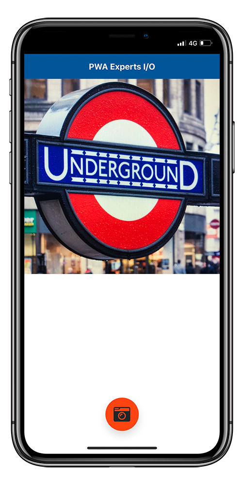

# Tutorial PWA Camera Capture [](https://github.com/RichardLitt/standard-readme)

🚀 Increase the characteristics of your PWA with JavaScript. 📷 Activate your device's camera and capture photos easily.



## Installation

```bash
npm i
```

## Run

```bash
node .
```

Open: localhost:8080

## Maintainers
 \
[@JoseJPR](https://github.com/JoseJPR)

## Contact
🎓 Linkedin: https://www.linkedin.com/in/josejpr/ \
🐦 Twitter: https://twitter.com/JoseJ_PR \
📧 Send email to: me@josejpr.com

## License
[MIT](LICENSE.md)

## Happy Code
Created with JavaScript, lot of ❤️ and a few 🍺

#### This README.md file has been written keeping in mind:
- [GitHub Markdown](https://guides.github.com/features/mastering-markdown/)
- [Emoji Cheat Sheet](https://www.webfx.com/tools/emoji-cheat-sheet/)