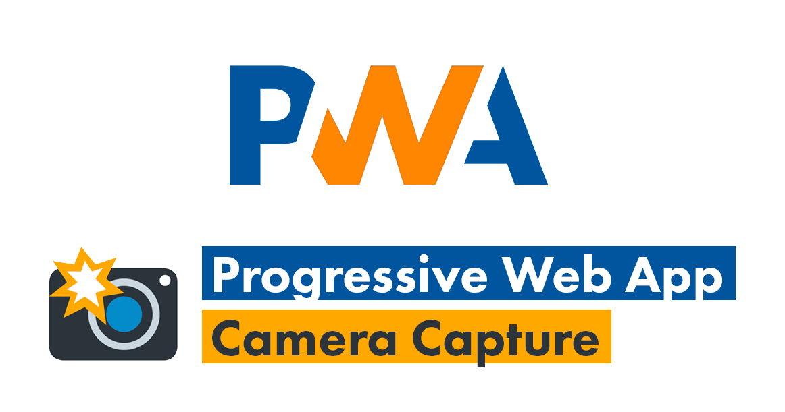

<p align="center">
  
</p>

<h1 align="center">Tutorial PWA Camera Capture</h1>

<p align="center">🚀 Increase the characteristics of your PWA with JavaScript. 📷 Activate your device's camera and capture photos easily.</p>

<p align="center">
  <a title="MIT License" href="LICENSE.md">
    
  </a>
  <a title="Twitter: JoseJ_PR" href="https://twitter.com/JoseJ_PR">
    
  </a>  
  <a title="Github: Sponsors" href="https://github.com/sponsors/JoseJPR">
    
  </a>
  <br />
  <br />
</p>

## 🔖 Description

In this tutorial I show you how you can create a PWA and how you can capture photos from the camera and store them into a Web Server.

🎁 Bonus: The image will be stored on a NodeJS server using the Koa and Multer libraries.

## 📹 Video Demo

The following video shows how yo can launch this project and test it.

[](https://youtu.be/o_SrnMTI-x8)

## ⛅️ Develop in the Cloud

You can run this project in Gitpod, a one-click online IDE for GitHub:

[](https://gitpod.io/#https://github.com/JoseJPR/tutorial-pwa-capture-camera)

## 📐 How to work with this project

You have to do the following steps to be able to work with this project.

### 1️⃣ Install NodeJS Dependencies

```bash
npm i
```

### 2️⃣ Run

```bash
node .
```

Open: localhost:8080

## 📂 Code scaffolding

```any
/
├── assets 🌈               # Images Sources.
├── src 📦                  # Main App.
|   ├── css                 # Styles files.
|   ├── images              # Icons and others png files.
|   ├── js                  # JS files.
|   └── ...
└── ...
```

## ⛽️ Review and Update Dependences

For review and update all npm dependences of this project you need install in global npm package "npm-check-updates" npm module.

```bash
# Install and Run
$npm i -g npm-check-updates
$ncu
```

## License
[MIT](LICENSE.md)

## Happy Code
Created with JavaScript, lot of ❤️ and a few 🍺

#### This README.md file has been written keeping in mind:
- [GitHub Markdown](https://guides.github.com/features/mastering-markdown/)
- [Emoji Cheat Sheet](https://www.webfx.com/tools/emoji-cheat-sheet/)